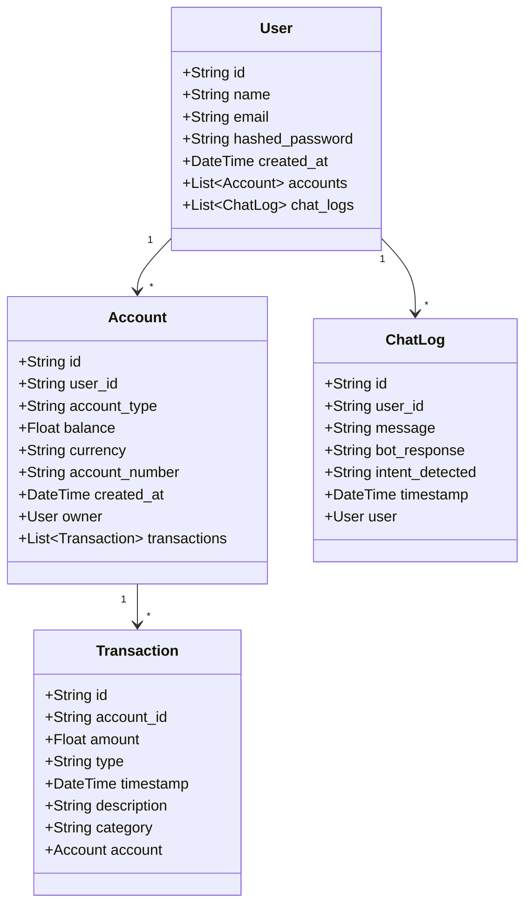
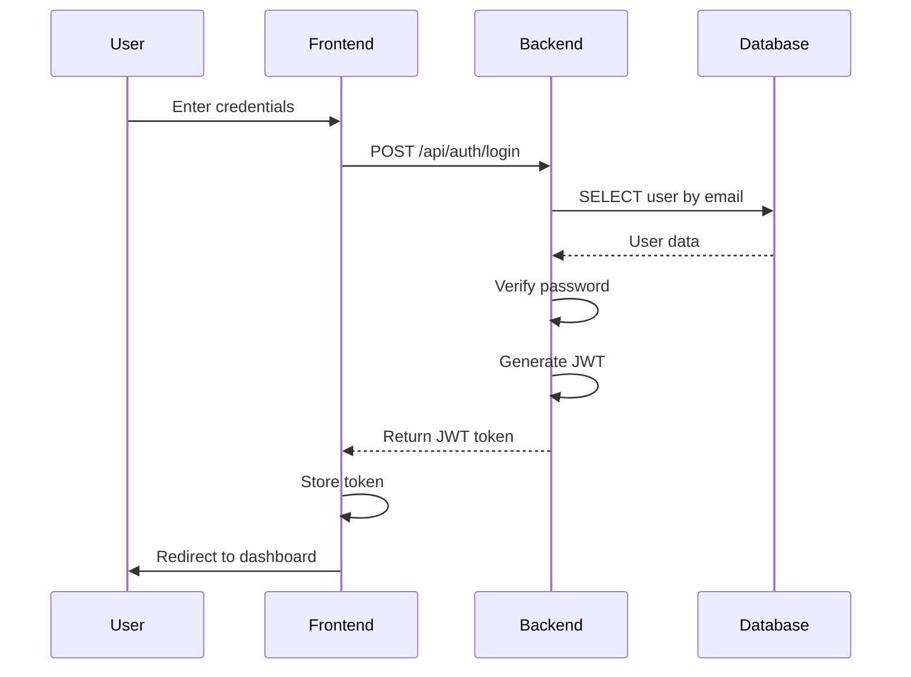

# Week 3: AI in Software Design

## Overview

This document demonstrates how AI was used in Software Design for the SmartBank Assistant project, including design patterns, architecture support, and diagram generation & validation.

## 1. AI for Design Patterns

### 1.1 Pattern Selection

**AI Tool**: ChatGPT, Cursor  
**Approach**: AI-assisted design pattern recommendations

**Initial Prompt:**
> "What design patterns should I use for a FastAPI backend with React frontend banking application?"

**AI-Recommended Patterns:**

#### 1. Repository Pattern
**Purpose**: Abstract database operations  
**Implementation**: CRUD modules in `backend/app/crud/`

```python
# AI-Generated Structure
class UserRepository:
    async def create_user(db, user_data)
    async def get_user_by_email(db, email)
    async def update_user(db, user_id, user_data)
    async def delete_user(db, user_id)
```

**Benefits** (AI-Identified):
- Separation of concerns
- Easier testing (mock repositories)
- Database-agnostic code

#### 2. Dependency Injection Pattern
**Purpose**: Loose coupling, testability  
**Implementation**: FastAPI's `Depends()` mechanism

```python
# AI-Generated Example
@router.get("/accounts")
async def get_accounts(
    current_user: User = Depends(get_current_user),
    db: AsyncSession = Depends(get_db)
):
    return await account_crud.get_user_accounts(db, current_user.id)
```

**Benefits** (AI-Identified):
- Easy to mock dependencies in tests
- Clear dependency relationships
- Better code organization

#### 3. Service Layer Pattern
**Purpose**: Business logic separation  
**Implementation**: Services in `backend/app/services/`

```python
# AI-Generated Structure
class GeminiService:
    def __init__(self):
        self.model = genai.GenerativeModel('gemini-pro')
    
    async def process_banking_query(self, message, context):
        # Business logic here
        pass
```

**Benefits** (AI-Identified):
- Reusable business logic
- Easier to test
- Clear separation from API layer

#### 4. Factory Pattern
**Purpose**: Object creation  
**Implementation**: Database session factory

```python
# AI-Generated
def get_db() -> AsyncGenerator[AsyncSession, None]:
    async with SessionLocal() as session:
        try:
            yield session
        finally:
            await session.close()
```

### 1.2 Pattern Implementation

**AI-Assisted Implementation:**

**Prompt:**
> "Implement the Repository pattern for user operations with async/await"

**AI-Generated Code:**
```python
# backend/app/crud/user.py
async def create_user(db: AsyncSession, user: UserCreate, hashed_password: str):
    db_user = User(
        name=user.name,
        email=user.email,
        hashed_password=hashed_password
    )
    db.add(db_user)
    await db.commit()
    await db.refresh(db_user)
    return db_user

async def get_user_by_email(db: AsyncSession, email: str):
    result = await db.execute(select(User).where(User.email == email))
    return result.scalar_one_or_none()
```

## 2. AI for Architecture Support

### 2.1 Architecture Design

**AI Tool**: ChatGPT  
**Approach**: Iterative architecture discussion

**Initial Prompt:**
> "Design the architecture for a banking web application with AI chatbot"

**AI-Generated Architecture:**

```
┌─────────────────────────────────────────┐
│         Presentation Layer               │
│      React Frontend (Port 3000)         │
│  - UI Components                        │
│  - State Management                     │
│  - API Client                           │
└─────────────────────────────────────────┘
                  ↕ HTTP/REST
┌─────────────────────────────────────────┐
│        Application Layer                │
│      FastAPI Backend (Port 8000)       │
│  - REST API Endpoints                  │
│  - Business Logic                      │
│  - Authentication                      │
│  - AI Service Integration              │
└─────────────────────────────────────────┘
                  ↕ SQLAlchemy ORM
┌─────────────────────────────────────────┐
│           Data Layer                    │
│      PostgreSQL Database               │
│  - User Data                           │
│  - Account Data                        │
│  - Transaction Data                    │
│  - Chat Logs                           │
└─────────────────────────────────────────┘
```

**AI Rationale:**
- **3-Tier Architecture**: Clear separation of concerns
- **RESTful API**: Standard communication protocol
- **ORM**: Database abstraction
- **Microservices-ready**: Can split services later

### 2.2 Component Architecture

**AI-Generated Component Structure:**

**Backend Components:**
```
backend/
├── app/
│   ├── main.py              # Application entry
│   ├── db.py                # Database configuration
│   ├── routes/              # API endpoints
│   │   ├── auth.py
│   │   ├── account.py
│   │   ├── transaction.py
│   │   └── chat.py
│   ├── crud/                # Database operations
│   ├── schemas/             # Data validation
│   ├── services/            # Business logic
│   │   └── gemini_service.py
│   └── auth/                # Authentication
│       ├── jwt_handler.py
│       └── dependencies.py
└── models/
    └── models.py            # Database models
```

**AI Explanation:**
- **Routes**: API endpoint definitions
- **CRUD**: Data access layer (Repository pattern)
- **Schemas**: Data validation (Pydantic)
- **Services**: Business logic (Service pattern)
- **Auth**: Authentication module (Separation of concerns)

### 2.3 Data Flow Architecture

**AI-Generated Data Flow:**

**Authentication Flow:**
```
User → Frontend → Backend API → Database
                ↓
            JWT Token ← Backend
                ↓
            Frontend (store token)
```

**Chat Flow:**
```
User → Frontend → Backend API → Database (get context)
                ↓
            Gemini AI API
                ↓
            Backend (process response)
                ↓
            Database (save chat log)
                ↓
            Frontend (display)
```

## 3. AI for Diagram Generation & Validation

### 3.1 UML Class Diagram Generation

**AI Tool**: ChatGPT, Cursor  
**Approach**: Code-to-diagram generation

**Prompt:**
> "Generate a UML class diagram for these database models: User, Account, Transaction, ChatLog"

**AI-Generated Diagram (Mermaid):**


### 3.2 Sequence Diagram Generation

**AI-Generated Sequence Diagrams:**

**Prompt:**
> "Generate a sequence diagram for user login flow"

**AI Output:**


### 3.3 Architecture Diagram Validation

**AI Validation Process:**

**Prompt:**
> "Review this architecture and identify potential issues or improvements"

**AI Feedback:**

✅ **Strengths:**
- Clear separation of layers
- RESTful API design
- Proper use of ORM
- Security considerations (JWT)

⚠️ **Suggestions:**
- Consider adding caching layer (Redis) for performance
- Add API gateway for rate limiting
- Consider message queue for async operations
- Add monitoring and logging layer

**Implemented Improvements:**
- Added CORS middleware
- Added error handling middleware
- Added logging configuration

### 3.4 Database Schema Design

**AI-Assisted Schema Design:**

**Prompt:**
> "Design database schema for banking app with users, accounts, transactions, and chat logs"

**AI-Generated Schema:**
```sql
-- Users table
CREATE TABLE users (
    id VARCHAR(36) PRIMARY KEY,
    name VARCHAR NOT NULL,
    email VARCHAR UNIQUE NOT NULL,
    hashed_password VARCHAR NOT NULL,
    created_at TIMESTAMP DEFAULT CURRENT_TIMESTAMP
);

-- Accounts table
CREATE TABLE accounts (
    id VARCHAR(36) PRIMARY KEY,
    user_id VARCHAR(36) REFERENCES users(id),
    account_type VARCHAR NOT NULL,
    balance FLOAT DEFAULT 0.0,
    currency VARCHAR DEFAULT 'USD',
    account_number VARCHAR UNIQUE,
    created_at TIMESTAMP DEFAULT CURRENT_TIMESTAMP
);

-- Transactions table
CREATE TABLE transactions (
    id VARCHAR(36) PRIMARY KEY,
    account_id VARCHAR(36) REFERENCES accounts(id),
    amount FLOAT NOT NULL,
    type VARCHAR NOT NULL,
    timestamp TIMESTAMP DEFAULT CURRENT_TIMESTAMP,
    description TEXT,
    category VARCHAR
);

-- Chat logs table
CREATE TABLE chat_logs (
    id VARCHAR(36) PRIMARY KEY,
    user_id VARCHAR(36) REFERENCES users(id),
    message TEXT NOT NULL,
    bot_response TEXT,
    intent_detected VARCHAR,
    timestamp TIMESTAMP DEFAULT CURRENT_TIMESTAMP,
    is_user VARCHAR DEFAULT 'true'
);
```

**AI Validation:**
- ✅ Proper foreign key relationships
- ✅ Appropriate data types
- ✅ Indexes on frequently queried fields
- ✅ Timestamps for audit trail

## 4. Design Decisions

### 4.1 Technology Stack Selection

**AI-Assisted Decision Making:**

**Prompt:**
> "Recommend technology stack for banking app: FastAPI vs Django, React vs Vue, PostgreSQL vs MongoDB"

**AI Recommendations:**

| Component | Recommendation | Rationale |
|-----------|---------------|-----------|
| **Backend** | FastAPI | Async support, automatic API docs, high performance |
| **Frontend** | React | Large ecosystem, TypeScript support, component reusability |
| **Database** | PostgreSQL | ACID compliance, relational data, banking requirements |
| **ORM** | SQLAlchemy | Mature, async support, type safety |
| **AI** | Google Gemini | Banking-friendly, good NLP, API availability |

### 4.2 API Design

**AI-Generated API Structure:**

**RESTful Endpoints:**
```
Authentication:
  POST   /api/auth/register
  POST   /api/auth/login
  POST   /api/auth/logout

Accounts:
  GET    /api/accounts
  POST   /api/accounts
  GET    /api/accounts/{id}

Transactions:
  GET    /api/transactions
  POST   /api/transactions
  GET    /api/transactions/{id}

Chat:
  POST   /api/chat/message
  GET    /api/chat/history
```

**AI Validation:**
- ✅ RESTful conventions followed
- ✅ Proper HTTP methods
- ✅ Resource-based URLs
- ✅ Consistent naming

### 4.3 Security Design

**AI-Generated Security Architecture:**

**Layers:**
1. **Authentication**: JWT tokens
2. **Authorization**: Role-based (future)
3. **Data Validation**: Pydantic schemas
4. **Password Security**: Bcrypt hashing
5. **CORS Protection**: Allowed origins
6. **SQL Injection**: ORM parameterization

**AI Recommendations:**
- JWT expiration: 30 minutes
- Password hashing: bcrypt with 10+ rounds
- CORS: Whitelist specific origins
- Rate limiting: Implement for API endpoints

## 5. Design Patterns in Implementation

### 5.1 Repository Pattern

**Implementation:**
```python
# backend/app/crud/user.py
async def create_user(db: AsyncSession, user: UserCreate, hashed_password: str):
    """Create a new user"""
    db_user = User(
        name=user.name,
        email=user.email,
        hashed_password=hashed_password
    )
    db.add(db_user)
    await db.commit()
    await db.refresh(db_user)
    return db_user
```

**AI Benefits Identified:**
- Database operations abstracted
- Easy to test with mock database
- Consistent data access patterns

### 5.2 Service Layer Pattern

**Implementation:**
```python
# backend/app/services/gemini_service.py
class GeminiService:
    async def process_banking_query(self, message: str, context: dict):
        # Business logic for AI processing
        prompt = self._create_banking_prompt(message, context)
        response = self.model.generate_content(prompt)
        return self._parse_response(response)
```

**AI Benefits Identified:**
- Business logic separated from API
- Reusable across different endpoints
- Easier to test and mock

### 5.3 Dependency Injection

**Implementation:**
```python
# FastAPI's built-in DI
@router.get("/accounts")
async def get_accounts(
    current_user: User = Depends(get_current_user),
    db: AsyncSession = Depends(get_db)
):
    return await account_crud.get_user_accounts(db, current_user.id)
```

**AI Benefits Identified:**
- Automatic dependency resolution
- Easy testing with mocks
- Clear dependency graph

## 6. Design Validation

### 6.1 Architecture Review

**AI Review Questions:**
1. ✅ Is the architecture scalable?
2. ✅ Are components loosely coupled?
3. ✅ Is security properly implemented?
4. ✅ Are best practices followed?
5. ✅ Is the design maintainable?

**AI Feedback:**
- Architecture is scalable (can add more services)
- Components are well-separated
- Security layers are appropriate
- Follows RESTful and SOLID principles
- Code is modular and maintainable

### 6.2 Design Improvements

**AI-Suggested Improvements:**

1. **Add Caching Layer**
   - Cache frequently accessed data
   - Reduce database load
   - Improve response times

2. **Add API Gateway**
   - Rate limiting
   - Request routing
   - Authentication centralization

3. **Add Monitoring**
   - Application performance monitoring
   - Error tracking
   - Usage analytics

## 7. Impact on Project

### 7.1 Benefits

✅ **Better Architecture**: AI-assisted design resulted in clean, scalable architecture  
✅ **Design Patterns**: Proper use of patterns improved code quality  
✅ **Documentation**: AI-generated diagrams improved documentation  
✅ **Validation**: AI review caught potential issues early  
✅ **Time Savings**: ~50% faster design phase

### 7.2 Design Quality Metrics

- **Coupling**: Low (well-separated components)
- **Cohesion**: High (related functionality grouped)
- **Maintainability**: High (modular structure)
- **Scalability**: High (can add services easily)
- **Security**: High (multiple security layers)

## 8. Conclusion

AI significantly enhanced the Software Design phase by:

1. **Pattern Selection**: Recommended appropriate design patterns
2. **Architecture Design**: Helped design scalable 3-tier architecture
3. **Diagram Generation**: Created comprehensive UML diagrams
4. **Design Validation**: Reviewed and improved the design
5. **Documentation**: Generated design documentation

The AI-assisted design approach resulted in a well-structured, maintainable, and scalable architecture.

---

**Next**: [Week 4: AI in Coding & Development (I)](week4-coding1.md)

